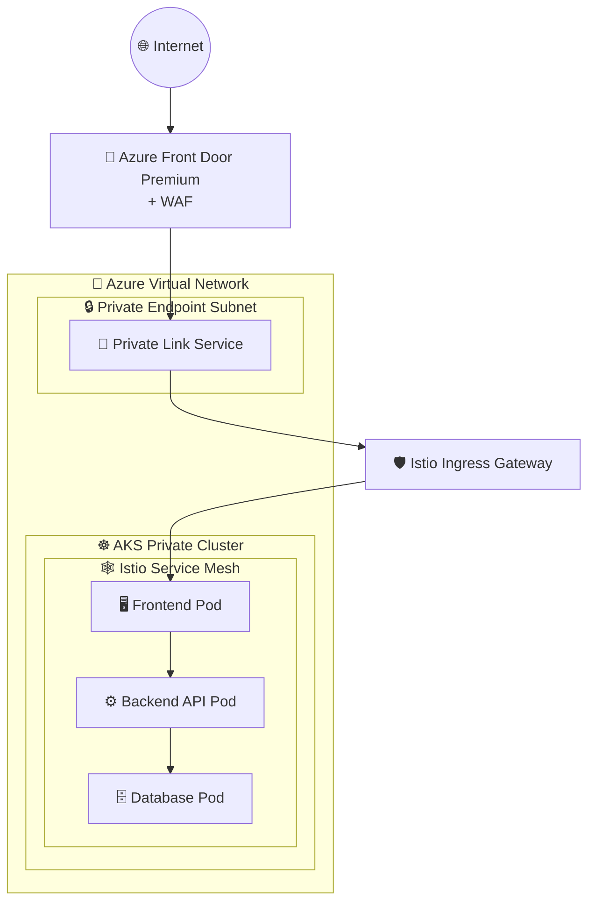

# Azure Front Door + Private Link Service + Istio Gateway セキュアアーキテクチャ

[](https://opensource.org/licenses/MIT)
[](https://terraform.io)
[](https://azure.microsoft.com)
[](https://istio.io)

## 🌟 概要

このリポジトリは、**Azure Front Door** → **Private Link Service** → **Istio Gateway** → **Pod** の完全なセキュアトラフィックフローを実装したサンプルプロジェクトです。エンタープライズレベルのセキュリティとスケーラビリティを実現するための実践的なリファレンス実装を提供します。

## 🏗️ アーキテクチャ概要



### 🔄 トラフィックフロー詳細

1. **Internet → Azure Front Door**: グローバルエニーキャストによる最適ルーティング
2. **Front Door → Private Link Service**: プライベート接続でAzureバックボーン経由
3. **PLS → Istio Ingress Gateway**: AKSクラスター内のLoadBalancerサービス経由
4. **Istio Gateway → Pods**: mTLS暗号化とマイクロセグメンテーション

## 🚀 主要コンポーネント

| コンポーネント | 役割 | セキュリティ機能 |
|---|---|---|
| **Azure Front Door Premium** | グローバルCDN・ロードバランサー | WAF, DDoS保護, TLS終端 |
| **Private Link Service** | プライベートネットワーク接続 | トラフィック分離, NAT |
| **AKS Private Cluster** | マネージドKubernetes | プライベートAPI Server, Azure CNI |
| **Istio Service Mesh** | マイクロサービス通信基盤 | mTLS, 認可ポリシー, 可観測性 |
| **Istio Ingress Gateway** | クラスター入口制御 | TLS終端, レート制限, 認証 |

## 🔒 セキュリティ実装詳細

### ✅ ゼロトラストネットワーク
- **パブリックインターネットからAKS APIへの直接アクセス完全遮断**
- **Private Link Serviceによる完全プライベート通信**
- **Istio mTLSによるサービス間暗号化**
- **WAFによるOWASP Top 10対応**
- **Network Security Groupsによる詳細なトラフィック制御**

### 🛡️ 実装セキュリティ機能
- **Azure Front Door WAF**: SQLインジェクション、XSS、その他の脅威をブロック
- **Private Link Service**: インターネット経由ではなくAzureバックボーンを使用
- **AKS Private Cluster**: Kubernetes API ServerはプライベートIPのみ
- **Istio Authorization Policies**: 詳細なサービス間アクセス制御
- **Pod Security Standards**: 制限されたPodセキュリティコンテキスト

## 🛠️ 技術スタック

- **Infrastructure as Code**: Terraform
- **Container Orchestration**: Azure Kubernetes Service (AKS)
- **Service Mesh**: Istio 1.19+
- **Global Load Balancer**: Azure Front Door Premium
- **Network Security**: Private Link Service, Network Security Groups
- **Monitoring**: Azure Monitor, Prometheus, Grafana
- **Logging**: Azure Log Analytics, Fluent Bit

## 📋 前提条件

### 必要なツール
- [Azure CLI](https://docs.microsoft.com/en-us/cli/azure/install-azure-cli) (v2.50+)
- [Terraform](https://www.terraform.io/downloads.html) (v1.0+)
- [kubectl](https://kubernetes.io/docs/tasks/tools/) (最新安定版)
- [jq](https://stedolan.github.io/jq/) (JSONパーサー)

### Azure権限
- サブスクリプション共同作成者ロール、または
- カスタムロール（AKS、Front Door、ネットワーキング権限）

### リソース要件
- Azure サブスクリプション
- 利用可能なパブリックIP (Front Door用)
- AKSクラスター用の十分なコンピューティングクォータ

## 🚀 クイックスタート

### 1️⃣ リポジトリの準備
```bash
# リポジトリをクローン
git clone https://github.com/your-username/frontdoor-istio-private-aks.git
cd frontdoor-istio-private-aks

# 環境変数を設定
cp .env.example .env
# .envファイルを編集して必要な値を設定
```

### 2️⃣ Azure認証
```bash
# Azureにログイン
az login

# サブスクリプションを設定
az account set --subscription "your-subscription-id"
```

### 3️⃣ インフラストラクチャデプロイ
```bash
# すべてのリソースをデプロイ
./scripts/deploy.sh

# または段階的にデプロイ
./scripts/deploy.sh --step infrastructure
./scripts/deploy.sh --step istio  
./scripts/deploy.sh --step applications
```

### 4️⃣ 動作確認
```bash
# 接続テスト実行
./scripts/test-connectivity.sh

# Istio設定確認
kubectl get gateway,virtualservice -n istio-system
```

### 5️⃣ クリーンアップ
```bash
# 全リソース削除
./scripts/cleanup.sh
```

## 📂 プロジェクト構造

```
frontdoor-istio-private-aks/
├── 📖 README.md                    # このファイル
├── 📋 requirements.md              # 詳細要件定義
├── 🏗️ architecture.md              # アーキテクチャ詳細
├── ⚙️ .env.example                 # 環境変数テンプレート
├── 🏗️ terraform/                   # Infrastructure as Code
│   ├── main.tf                   # メインTerraformファイル
│   ├── variables.tf              # 変数定義
│   ├── outputs.tf                # 出力値定義
│   ├── versions.tf               # プロバイダーバージョン
│   └── modules/                  # Terraformモジュール
│       ├── aks/                  # AKSクラスター
│       ├── frontdoor/            # Azure Front Door
│       ├── networking/           # VNet, NSG, PLS
│       └── monitoring/           # 監視設定
├── ☸️ kubernetes/                  # Kubernetesマニフェスト
│   ├── istio/                    # Istio設定
│   │   ├── gateway.yaml          # Istio Gateway + VirtualService
│   │   ├── fqdn-gateway.yaml     # FQDN用Gateway設定
│   │   ├── simple-gateway.yaml   # シンプルGateway設定
│   │   ├── security.yaml         # セキュリティポリシー
│   │   └── istio-operator.yaml   # Istio Operator設定
│   ├── applications/             # アプリケーション
│   │   ├── frontend.yaml         # フロントエンドPod
│   │   └── backend.yaml          # バックエンドPod
│   ├── demo-app.yaml             # デモアプリケーション
│   ├── istio-gateway.yaml        # メインIstio Gateway
│   └── private-link-service.yaml # Private Link Service
├── 🔧 scripts/                     # 自動化スクリプト
│   ├── deploy.sh                 # デプロイメント
│   ├── cleanup.sh                # クリーンアップ
│   ├── quick-deploy.sh           # クイックデプロイ
│   └── test-connectivity.sh      # 接続テスト
└── 📚 docs/                        # ドキュメント
    ├── deployment-guide.md       # デプロイメントガイド
    ├── troubleshooting.md        # トラブルシューティング
    └── security-considerations.md # セキュリティ考慮事項
```

## 🔧 デプロイメント詳細

詳細なデプロイメント手順については、[📖 デプロイメントガイド](docs/deployment-guide.md)を参照してください。

### 主要な設定ポイント

1. **Terraform変数設定** (`terraform/variables.tf`)
2. **Istio Gateway設定** (`kubernetes/istio/gateway.yaml`)
3. **Private Link Service設定** (`kubernetes/private-link-service.yaml`)
4. **Front Door設定** (`terraform/modules/frontdoor/`)

## 🐛 トラブルシューティング

問題が発生した場合は、[🔍 トラブルシューティングガイド](docs/troubleshooting.md)を参照してください。

### よくある問題
- Front DoorからPLSへの接続エラー
- Istio Gatewayの証明書問題
- AKS Private Clusterへのアクセス問題

## 📊 監視・可観測性

### Istio観測性ツール
```bash
# Kiali (サービストポロジー)
kubectl port-forward -n istio-system svc/kiali 20001:20001

# Grafana (メトリクス)
kubectl port-forward -n istio-system svc/grafana 3000:3000

# Jaeger (分散トレーシング)
kubectl port-forward -n istio-system svc/jaeger 16686:16686
```

### Azure Monitor統合
- Application Insights
- Log Analytics
- Azure Monitor for containers

## 📚 技術リソース・参考資料

### 🏛️ 公式ドキュメント

#### Azure Front Door
- [Azure Front Door とは](https://docs.microsoft.com/ja-jp/azure/frontdoor/front-door-overview)
- [Front Door での Private Link](https://docs.microsoft.com/ja-jp/azure/frontdoor/private-link)
- [WAF ポリシーの設定](https://docs.microsoft.com/ja-jp/azure/web-application-firewall/afds/waf-front-door-create-portal)

#### Azure Kubernetes Service (AKS)
- [AKS プライベート クラスター](https://docs.microsoft.com/ja-jp/azure/aks/private-clusters)
- [Azure CNI ネットワーク](https://docs.microsoft.com/ja-jp/azure/aks/configure-azure-cni)
- [AKS でのセキュリティのベストプラクティス](https://docs.microsoft.com/ja-jp/azure/aks/operator-best-practices-cluster-security)

#### Private Link Service
- [Azure Private Link Service とは](https://docs.microsoft.com/ja-jp/azure/private-link/private-link-service-overview)
- [Private Link Service の作成](https://docs.microsoft.com/ja-jp/azure/private-link/create-private-link-service-portal)

#### Istio Service Mesh
- [Istio 公式ドキュメント](https://istio.io/latest/docs/)
- [Istio Ingress Gateway](https://istio.io/latest/docs/tasks/traffic-management/ingress/ingress-control/)
- [Istio セキュリティ](https://istio.io/latest/docs/concepts/security/)
- [AKS での Istio](https://docs.microsoft.com/ja-jp/azure/aks/servicemesh-istio-about)

### 🎯 実装パターン・ベストプラクティス

#### セキュリティ
- [Azure Well-Architected Framework - セキュリティ](https://docs.microsoft.com/ja-jp/azure/architecture/framework/security/)
- [AKS でのゼロトラスト ネットワーク](https://docs.microsoft.com/ja-jp/azure/aks/operator-best-practices-network)
- [Kubernetes セキュリティのベストプラクティス](https://kubernetes.io/docs/concepts/security/)

#### アーキテクチャパターン
- [Azure Architecture Center - Microservices](https://docs.microsoft.com/ja-jp/azure/architecture/microservices/)
- [Landing Zone for AKS](https://docs.microsoft.com/ja-jp/azure/cloud-adoption-framework/scenarios/aks/)

### 🔗 関連GitHub リポジトリ

- [Azure/AKS](https://github.com/Azure/AKS) - AKS公式サンプル
- [istio/istio](https://github.com/istio/istio) - Istio本家
- [Azure/azure-quickstart-templates](https://github.com/Azure/azure-quickstart-templates) - Azureクイックスタートテンプレート
- [Azure-Samples/aks-private-cluster](https://github.com/Azure-Samples/aks-private-cluster) - AKSプライベートクラスターサンプル

### 🎥 学習リソース

#### Microsoft Learn
- [Azure Front Door の構成](https://docs.microsoft.com/ja-jp/learn/modules/intro-to-azure-front-door/)
- [Azure Kubernetes Service (AKS) の概要](https://docs.microsoft.com/ja-jp/learn/modules/intro-to-azure-kubernetes-service/)
- [サービス メッシュの概要](https://docs.microsoft.com/ja-jp/learn/modules/implement-service-mesh/)

## 🤝 コントリビューション

プルリクエスト、Issue、改善提案を歓迎します！

1. このリポジトリをフォーク
2. フィーチャーブランチを作成 (`git checkout -b feature/amazing-feature`)
3. 変更をコミット (`git commit -m 'Add amazing feature'`)
4. ブランチにプッシュ (`git push origin feature/amazing-feature`)
5. プルリクエストを作成

## 📄 ライセンス

このプロジェクトは [MIT License](LICENSE) の下で公開されています。

## 🏷️ タグ

`azure` `kubernetes` `aks` `istio` `front-door` `private-link` `terraform` `security` `zero-trust` `service-mesh` `microservices`

---

⭐ このリポジトリが役に立った場合は、スターをお願いします！

💬 質問や提案がある場合は、[Issues](../../issues) でお知らせください。
