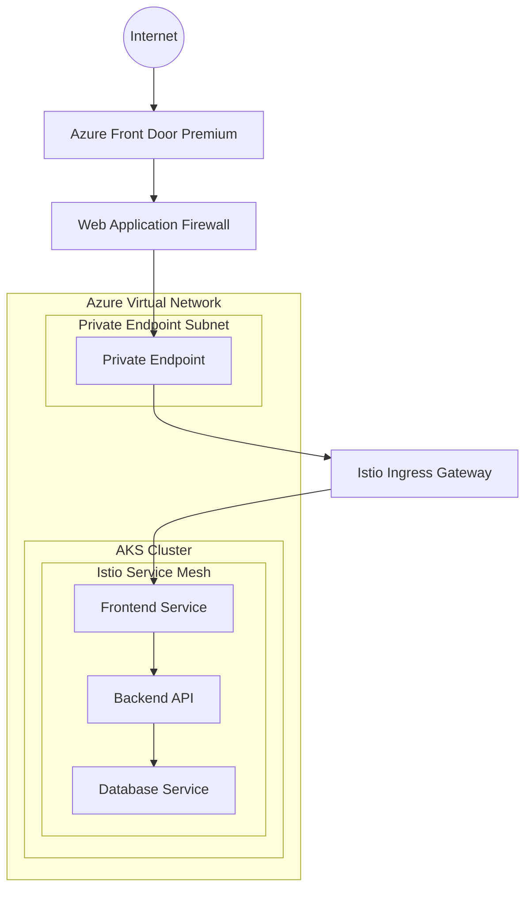

# アーキテクチャ設計書

## 1. システム概要

このシステムは、Azure Front DoorとIstio Service Mesh、Azure Kubernetes Service (AKS)を組み合わせたセキュアなマイクロサービスアーキテクチャです。

## 2. 全体アーキテクチャ



## 3. ネットワークアーキテクチャ

### 3.1 ネットワーク構成

```text
Virtual Network: 10.0.0.0/16
├── AKS Subnet: 10.0.1.0/24
├── Private Endpoint Subnet: 10.0.2.0/24
├── Gateway Subnet: 10.0.3.0/24 (将来利用)
└── Management Subnet: 10.0.4.0/24 (将来利用)
```

### 3.2 セキュリティグループ設定

#### AKS Subnet NSG
- Inbound: Private Endpoint からのHTTPS (443) のみ許可
- Outbound: Azure サービスへのアクセス許可

#### Private Endpoint Subnet NSG
- Inbound: Azure Front Door からのアクセス許可
- Outbound: AKS Subnet への HTTPS アクセス許可

## 4. Istio Service Mesh 設計

### 4.1 Istio コンポーネント

```yaml
components:
  - istiod: Control Plane (AKS Managed)
  - istio-proxy: Data Plane (Sidecar)
  - istio-ingress-gateway: Traffic Entry Point
  - istio-egress-gateway: External Traffic Control (Optional)
```

### 4.2 セキュリティ設定

#### mTLS設定
```yaml
apiVersion: security.istio.io/v1beta1
kind: PeerAuthentication
metadata:
  name: default
  namespace: istio-system
spec:
  mtls:
    mode: STRICT
```

#### Authorization Policy
```yaml
apiVersion: security.istio.io/v1beta1
kind: AuthorizationPolicy
metadata:
  name: frontend-policy
  namespace: default
spec:
  selector:
    matchLabels:
      app: frontend
  rules:
  - from:
    - source:
        principals: ["cluster.local/ns/istio-system/sa/istio-ingressgateway-service-account"]
```

## 5. Azure Front Door 設計

### 5.1 ルーティング設定

```json
{
  "routes": [
    {
      "name": "default-route",
      "customDomains": ["example.com"],
      "originGroup": "aks-backend",
      "supportedProtocols": ["Https"],
      "patternsToMatch": ["/*"],
      "forwardingProtocol": "HttpsOnly"
    }
  ]
}
```

### 5.2 WAF設定

```json
{
  "policies": {
    "managedRules": [
      {
        "ruleSetType": "Microsoft_DefaultRuleSet",
        "ruleSetVersion": "2.1"
      },
      {
        "ruleSetType": "Microsoft_BotManagerRuleSet",
        "ruleSetVersion": "1.0"
      }
    ],
    "customRules": [
      {
        "name": "RateLimitRule",
        "priority": 100,
        "action": "Block",
        "ruleType": "RateLimitRule",
        "rateLimitThreshold": 1000
      }
    ]
  }
}
```

## 6. AKS クラスター設計

### 6.1 ノードプール構成

```hcl
node_pools = {
  system = {
    name                = "system"
    vm_size            = "Standard_D2s_v3"
    node_count         = 2
    availability_zones = ["1", "2", "3"]
    os_disk_size_gb    = 30
    os_disk_type       = "Managed"
    only_critical_addons_enabled = true
  }
  
  user = {
    name                = "user"
    vm_size            = "Standard_D4s_v3"
    node_count         = 3
    availability_zones = ["1", "2", "3"]
    os_disk_size_gb    = 100
    os_disk_type       = "Managed"
  }
}
```

### 6.2 セキュリティ設定

- **Private Cluster**: API Server への Private Access
- **Azure AD Integration**: RBAC認証
- **Pod Security Standards**: Restricted Profile適用
- **Network Policy**: Calico使用
- **Container Image Scanning**: Azure Defender for Containers

## 7. 監視・可観測性

### 7.1 メトリクス

```yaml
monitoring:
  prometheus:
    enabled: true
    retention: "30d"
  grafana:
    enabled: true
    dashboards:
      - istio-service-dashboard
      - aks-cluster-dashboard
      - application-dashboard
```

### 7.2 ログ

```yaml
logging:
  azure_monitor:
    enabled: true
    log_analytics_workspace: true
  fluentd:
    enabled: true
    outputs:
      - azure_monitor
      - elasticsearch (optional)
```

### 7.3 トレーシング

```yaml
tracing:
  jaeger:
    enabled: true
    storage: elasticsearch
    sampling_rate: 0.1
```

## 8. セキュリティ考慮事項

### 8.1 データ保護

- **転送時暗号化**: TLS 1.2+
- **保存時暗号化**: Azure Key Vault統合
- **シークレット管理**: Azure Key Vault + Secret Store CSI Driver

### 8.2 アクセス制御

- **Azure RBAC**: リソースレベルアクセス制御
- **Kubernetes RBAC**: Namespace レベルアクセス制御
- **Istio Authorization**: Service レベルアクセス制御

### 8.3 ネットワークセキュリティ

- **Zero Trust**: デフォルト拒否ポリシー
- **Micro-segmentation**: Service レベルネットワーク分離
- **DDoS Protection**: Azure DDoS Protection Standard

## 9. 災害復旧・事業継続

### 9.1 バックアップ戦略

```yaml
backup:
  etcd:
    enabled: true
    schedule: "0 2 * * *"
    retention: "30d"
  persistent_volumes:
    enabled: true
    schedule: "0 3 * * *"
    retention: "7d"
```

### 9.2 高可用性

- **Multi-AZ Deployment**: 3つのAvailability Zone使用
- **Auto-scaling**: HPA + VPA + Cluster Autoscaler
- **Health Checks**: Liveness + Readiness + Startup Probes

## 10. パフォーマンス最適化

### 10.1 リソース設定

```yaml
resources:
  frontend:
    requests:
      cpu: "100m"
      memory: "128Mi"
    limits:
      cpu: "500m"
      memory: "512Mi"
  backend:
    requests:
      cpu: "200m"
      memory: "256Mi"
    limits:
      cpu: "1000m"
      memory: "1Gi"
```

### 10.2 スケーリング設定

```yaml
autoscaling:
  hpa:
    min_replicas: 2
    max_replicas: 10
    target_cpu_utilization: 70
    target_memory_utilization: 80
  vpa:
    enabled: true
    update_mode: "Auto"
```

## 11. 運用考慮事項

### 11.1 デプロイメント戦略

- **Blue-Green Deployment**: Istio Virtual Service活用
- **Canary Deployment**: Traffic Splitting使用
- **Rolling Update**: Kubernetes標準機能

### 11.2 監視・アラート

```yaml
alerts:
  - name: high_cpu_usage
    condition: cpu > 80%
    duration: 5m
  - name: high_memory_usage
    condition: memory > 85%
    duration: 5m
  - name: pod_restart_high
    condition: restart_count > 5
    duration: 10m
```
